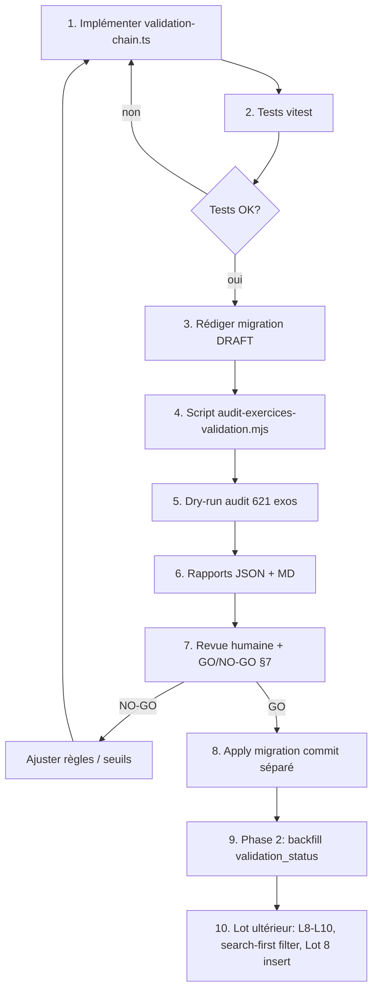

# Plan Lot 9 — Socle validation (implémentation minimale)

**Projet :** `primo-fluency-hub`  
**Date :** 7 juillet 2026  
**Référence :** `docs/validation-auto-exercices-plan.md` (§1–7, §11 phase 1–2), `docs/lot8-p0-plan.md` (§4.4)

## Décision et statut

| Élément | Valeur |
|---------|--------|
| **Statut** | Plan d'implémentation — aucun code, aucune migration appliquée |
| **Périmètre** | Socle validation L1-L7 déterministe + audit dry-run 621 exercices |
| **Hors scope** | IA, insertion exercices, scoring search-first, apply migration |

---

## 1. Résumé Lot 9 (1 page)

### Objectif

Poser le **socle de validation déterministe** avant toute persistance DB, génération IA ou insertion Lot 8. Lot 9 livre un pipeline pur en mémoire (`ValidationChain`), une migration SQL **draft non appliquée**, un audit dry-run de la banque (621 exercices), et des tests unitaires.

### Périmètre strict

| Inclus | Exclu |
|--------|-------|
| Migration draft `validation_*` | Application migration |
| `validation-chain.ts` L1–L7 déterministe | L8 IA, L9 doublon intra-pipeline, L10 scoring search-first |
| Audit dry-run JSON + MD | Écriture `validation_status` en DB |
| Tests vitest | Modification `exercise-search.ts` |
| | Génération IA, insertion exercices, `pedagogical_activities` |

### Architecture cible

```
exercice (row DB ou draft)
    → L1 validateExercise()          [exercise-validator.ts]
    → L2 hasUsableContent()          [exercise-search.ts — lecture seule]
    → L3 format ∈ FORMATS_BY_COMPETENCE  [formatsAutorisesForCompetence()]
    → L4 niveau CECRL déterministe
    → L5 thème IRN déterministe
    → L6 reviewExercise({ useAI: false })  [review-exercise.ts — couche déterministe]
    → L7 correction déterministe (CE vérifiable, ambiguïté)
    → agrégation issues + décision validation_status simulé
```

### Décision de statut (Lot 9 — sans L10)

En l'absence du score search-first (L10 différé), la décision s'appuie sur les issues L1–L7 :

| Statut simulé | Condition |
|---------------|-----------|
| `rejected` | ≥ 1 issue `severity === "error"` (toute couche) |
| `needs_review` | 0 error + trigger zone grise (voir §7) |
| `validated_auto` | 0 error + pas de trigger zone grise |

`validation_score` reste **nullable** en Lot 9 (ou score structurel interne non persisté) ; le score search-first 0–100 sera branché en lot ultérieur (L10).

### Alignement Lot 8

Le plan Lot 8 (§4.4) exige `validateExercise` + `hasUsableContent` + cohérence format/compétence avant insert. Lot 9 **formalise et centralise** ces règles dans `validation-chain.ts`. Le futur `sf-p0-validate.mjs` (Lot 8) importera ce module — pas dans Lot 9.

### Livrable attendu post-implémentation

- Module testé, 0 régression sur validateurs existants
- Rapport audit : distribution `validated_auto` / `needs_review` / `rejected` sur 621 lignes
- Migration draft prête pour revue SQL, **non exécutée**
- Base factuelle pour décider si/appliquer la migration et lancer le backfill (phase 2)

---

## 2. Fichiers à créer / modifier

### À créer

| Fichier | Rôle |
|---------|------|
| `supabase/migrations/DRAFT_20260708100000_exercices_validation_fields.sql` | Migration draft (ROLLBACK par défaut) |
| `supabase/functions/_shared/validation-chain.ts` | API ValidationChain L1–L7 |
| `supabase/functions/_shared/validation-chain.test.ts` | Tests unitaires vitest |
| `scripts/audit-exercices-validation.mjs` | Audit dry-run banque 621 |
| `docs/lot9-validation-socle-plan.md` | *(optionnel)* persistance de ce plan |

### À modifier (minimal)

| Fichier | Modification |
|---------|--------------|
| `package.json` | Script npm `"audit:validation": "node scripts/audit-exercices-validation.mjs"` ; ajout `tsx` en devDependency pour import TS depuis le script Node |
| `supabase/functions/_shared/review-exercise.ts` | *(optionnel)* exporter `deterministicReview` si `reviewExercise({ useAI: false })` insuffisant pour tests synchrones — préférer `useAI: false` sans changement |

### Lecture seule (imports, zéro diff)

| Fichier | Usage |
|---------|-------|
| `supabase/functions/_shared/exercise-validator.ts` | L1 — `validateExercise` |
| `supabase/functions/_shared/exercise-search.ts` | L2/L3/L4 — `hasUsableContent`, `formatsAutorisesForCompetence`, `niveauWindow`, `canonicalizeTheme` |
| `supabase/functions/_shared/review-exercise.ts` | L6 — `reviewExercise({ useAI: false })` |
| `scripts/backfill-exercices-metadata.mjs` | Pattern dry-run / manifest / Supabase client |

### Interdit Lot 9

- `exercise-search.ts` (scoring, seuils, `scoreGeneratedExercise`)
- `generate-exercises/*`, `fill-search-first-p0.mjs`
- Toute migration sans GO explicite post-audit
- `pedagogical_activities`

---

## 3. Migration SQL draft (outline)

**Fichier :** `supabase/migrations/DRAFT_20260708100000_exercices_validation_fields.sql`

**Convention :** préfixe `DRAFT_` + en-tête `DO NOT APPLY — Lot 9 socle` ; transaction terminée par `ROLLBACK` (même pattern que `20260707130000_normalize_exercices_contenu_string_to_object.sql`).

### Structure proposée

```sql
-- =============================================================================
-- DRAFT — Ne pas exécuter via supabase db push
-- Lot 9 : colonnes validation sur public.exercices
-- Revue requise après audit dry-run (scripts/audit-exercices-validation.mjs)
-- Default : ROLLBACK ; décommenter COMMIT après GO explicite
-- =============================================================================

BEGIN;

-- ─── 1. Colonnes ───────────────────────────────────────────────────────────
ALTER TABLE public.exercices
  ADD COLUMN IF NOT EXISTS validation_status text NOT NULL DEFAULT 'draft'
    CHECK (validation_status IN (
      'draft', 'validated_auto', 'needs_review', 'rejected', 'approved_human'
    )),
  ADD COLUMN IF NOT EXISTS validation_score smallint
    CHECK (validation_score IS NULL OR validation_score BETWEEN 0 AND 100),
  ADD COLUMN IF NOT EXISTS validation_issues jsonb NOT NULL DEFAULT '[]'::jsonb,
  ADD COLUMN IF NOT EXISTS validation_checked_at timestamptz,
  ADD COLUMN IF NOT EXISTS validation_source text
    CHECK (validation_source IS NULL OR validation_source IN (
      'pipeline_auto', 'import', 'backfill', 'human', 'regeneration'
    )),
  ADD COLUMN IF NOT EXISTS reviewed_by uuid REFERENCES public.profiles(id),
  ADD COLUMN IF NOT EXISTS reviewed_at timestamptz;

-- ─── 2. Index search-first (futur — non actif tant que Lot 9 n'a pas GO) ───
CREATE INDEX IF NOT EXISTS idx_exercices_validation_reuse
  ON public.exercices (competence, niveau_vise, validation_status)
  WHERE is_template = false AND eleve_id IS NULL
    AND validation_status IN ('validated_auto', 'approved_human');

-- ─── 3. Commentaires ───────────────────────────────────────────────────────
COMMENT ON COLUMN public.exercices.validation_status IS
  'Cycle QA distinct de statut éditorial (draft/validated/published)';
-- ... (autres COMMENT)

-- ─── 4. Vérification dry-run (lecture seule dans la transaction) ───────────
SELECT
  count(*) AS bank_total,
  count(*) FILTER (WHERE validation_status = 'draft') AS still_draft
FROM public.exercices
WHERE is_template = false AND eleve_id IS NULL;
-- Attendu post-migration : bank_total = 621, still_draft = 621

ROLLBACK;
-- COMMIT;  -- décommenter uniquement après GO §7
```

### ROLLBACK down-migration (documenté en commentaire)

```sql
-- DOWN (si migration appliquée par erreur) :
-- DROP INDEX IF EXISTS idx_exercices_validation_reuse;
-- ALTER TABLE public.exercices
--   DROP COLUMN IF EXISTS reviewed_at,
--   DROP COLUMN IF EXISTS reviewed_by,
--   DROP COLUMN IF EXISTS validation_source,
--   DROP COLUMN IF EXISTS validation_checked_at,
--   DROP COLUMN IF EXISTS validation_issues,
--   DROP COLUMN IF EXISTS validation_score,
--   DROP COLUMN IF EXISTS validation_status;
```

### Note importante

Les 621 lignes existantes gardent `validation_status = 'draft'` par défaut à l'apply. Le backfill des statuts calculés est **phase 2**, script séparé, après GO audit.

---

## 4. API `validation-chain.ts`

### Types

```typescript
export type ValidationLayer =
  | "L1_structure"
  | "L2_usable_content"
  | "L3_format_competence"
  | "L4_niveau"
  | "L5_theme"
  | "L6_pedagogie"
  | "L7_correction";

export interface ChainIssue {
  code: string;
  severity: "error" | "warning";
  message: string;
  field?: string;
  layer: ValidationLayer;
}

export interface ValidationChainContext {
  /** Optionnel — pour L4 level_doubtful vs cible séance */
  targetNiveauVise?: string;
  targetThemeId?: string;
  targetTypeDemarche?: string;
  /** Directives pédagogiques séance (L6) — null = règles par défaut */
  pedagogicalDirectives?: PedagogicalDirectives | null;
}

export type SimulatedValidationStatus =
  | "validated_auto"
  | "needs_review"
  | "rejected";

export interface ValidationChainResult {
  ok: boolean;                          // aucune error
  status: SimulatedValidationStatus;
  issues: ChainIssue[];
  layers: Record<ValidationLayer, { passed: boolean; issueCount: number }>;
  flags: string[];                      // ex. "sensitive_admin"
  structuralScore: number | null;       // placeholder Lot 9 (pas L10)
  checkedAt: string;                      // ISO8601
}
```

### Signatures publiques

```typescript
/** Point d'entrée principal — async car L6 appelle reviewExercise */
export async function runValidationChain(
  exercise: ExerciseLike & ExerciseRow,
  context?: ValidationChainContext,
): Promise<ValidationChainResult>;

/** Couches individuelles (testables, fail-fast optionnel) */
export function runLayerL1Structure(exercise: ExerciseLike): ChainIssue[];
export function runLayerL2UsableContent(exercise: ExerciseRow): ChainIssue[];
export function runLayerL3FormatCompetence(exercise: ExerciseRow): ChainIssue[];
export function runLayerL4Niveau(exercise: ExerciseRow, ctx?: ValidationChainContext): ChainIssue[];
export function runLayerL5Theme(exercise: ExerciseRow, ctx?: ValidationChainContext): ChainIssue[];
export async function runLayerL6Pedagogie(exercise: ExerciseLike, ctx?: ValidationChainContext): ChainIssue[];
export function runLayerL7Correction(exercise: ExerciseLike): ChainIssue[];

/** Agrégation + décision statut (sans L10) */
export function decideValidationStatus(
  issues: ChainIssue[],
  flags: string[],
): SimulatedValidationStatus;

/** Helpers audit */
export function hasBlockingChainIssue(issues: ChainIssue[]): boolean;
export function groupIssuesByCode(issues: ChainIssue[]): Record<string, number>;
```

### Couches incluses Lot 9 vs différées

| Couche | Lot 9 | Implémentation | Notes |
|--------|-------|----------------|-------|
| **L1** Structure | ✅ | `validateExercise()` → tag `layer: L1_structure` | Codes existants (`missing_title`, `qcm_*`, etc.) |
| **L2** Jouabilité | ✅ | `hasUsableContent()` → issue `not_usable_content` si false | Renforce CO/CE via L1 |
| **L3** Format/compétence | ✅ | `format ∉ formatsAutorisesForCompetence(competence)` → `EXCL_02_format_competence` | Matrice lecture seule |
| **L4** Niveau CECRL | ✅ | `invalid_niveau_vise`, `level_doubtful`, `EXCL_04_a0_production_ecrite` | `niveauWindow()` pour écart ±1 |
| **L5** Thème IRN | ✅ | `invalid_theme`, `missing_theme`, `theme_context_mismatch`, flag `sensitive_admin` | `canonicalizeTheme()` |
| **L6** Pédagogie | ✅ déterministe | `reviewExercise({ useAI: false })` → merge issues taggées L6 | **Pas d'appel Gemini** |
| **L7** Correction | ✅ | CE réponse dans `texte`, `ambiguous_correction`, `feedback_too_long` (A0/A1) | Complète L1 QCM/VF |
| **L8** Anti-hallucination | ❌ différé | — | Phase 5 du plan global |
| **L9** Anti-doublon | ❌ différé | Audit script peut rapporter doublons `metadata_code` à part | Nécessite contexte banque |
| **L10** Score search-first | ❌ différé | — | `scoreGeneratedExercise` non appelé ; pas de modification scoring |

### Règles L7 déterministes (nouveau code)

- **CE + QCM/VF :** normaliser `bonne_reponse` et vérifier présence dans `contenu.texte` (insensible casse/accents)
- **QCM :** si > 1 option plausible (match partiel) → `ambiguous_correction` warning
- **EE production_ecrite :** `limite_mots_max > 90` → warning `EXCL_03_word_limit` (aligné Lot 8, sans toucher scoring)

### `decideValidationStatus` (Lot 9)

```text
rejected     ← toute error L1–L7
needs_review ← 0 error ET (
                 ambiguous_correction
                 OR level_doubtful
                 OR sensitive_admin + warning L5/L6
                 OR ≥ 3 warnings distinctes (codes)
               )
validated_auto ← sinon
```

---

## 5. Script `scripts/audit-exercices-validation.mjs`

### Inspiration

Pattern `backfill-exercices-metadata.mjs` : `--dry-run` par défaut, manifest JSON, aucune écriture DB.

### CLI

```bash
# Dry-run (défaut) — lit Supabase, écrit rapports locaux uniquement
SUPABASE_URL=... SUPABASE_SERVICE_ROLE_KEY=... \
  npm run audit:validation

# Équivalent explicite
node scripts/audit-exercices-validation.mjs --dry-run

# Chemin de sortie personnalisé
node scripts/audit-exercices-validation.mjs --dry-run \
  --output-dir scripts/backups/validation-audit-20260708

# Filtre optionnel (debug)
node scripts/audit-exercices-validation.mjs --dry-run --limit 50
```

### Flags

| Flag | Défaut | Description |
|------|--------|-------------|
| `--dry-run` | **implicite** | Jamais d'UPDATE/INSERT (seul mode Lot 9) |
| `--apply` | absent | **Interdit Lot 9** — lever erreur si passé |
| `--output-dir PATH` | `scripts/backups/validation-audit-{timestamp}` | Dossier rapports |
| `--limit N` | tous | Sous-ensemble pour debug |
| `--format json,md` | `json,md` | Formats de sortie |

### Requête Supabase

```javascript
.from("exercices")
.select("id, titre, consigne, competence, format, niveau_vise, theme, contexte_irn, contenu, metadata_code, statut, difficulte, duree_limite_secondes, metadata, is_ai_generated, created_at")
.eq("is_template", false)
.is("eleve_id", null)
.limit(5000)
```

Vérification : `bank_total === 621` (warning si ≠ 621, comme migration normalize).

### Import validation-chain

```javascript
// Via tsx (devDependency)
import { runValidationChain, groupIssuesByCode } from "../supabase/functions/_shared/validation-chain.ts";
```

Exécution : `node --import tsx scripts/audit-exercices-validation.mjs` ou script npm wrapper.

### Contexte audit

Pour chaque exercice, appeler `runValidationChain(row, { targetNiveauVise: row.niveau_vise, targetThemeId: row.theme })` — cible = attributs propres de l'exercice (audit banque autonome, pas séance).

### Sorties

**`validation-audit-{timestamp}.json`**

```json
{
  "lot": "9-validation-socle",
  "generated_at": "ISO8601",
  "dry_run": true,
  "bank_total": 621,
  "pipeline_version": "L1-L7-deterministic",
  "summary": {
    "validated_auto": 0,
    "needs_review": 0,
    "rejected": 0,
    "by_competence": {},
    "by_issue_code": {},
    "top_rejected_codes": []
  },
  "duplicate_metadata_codes": [],
  "entries": [
    {
      "id": "uuid",
      "metadata_code": "...",
      "competence": "CE",
      "niveau_vise": "B2",
      "simulated_status": "validated_auto",
      "issue_count": 0,
      "issues": []
    }
  ]
}
```

**`validation-audit-{timestamp}.md`** — rapport lisible formateur :

- En-tête + métriques globales
- Tableau top 20 codes d'issues
- Liste exercices `rejected` (id, titre, codes)
- Liste `needs_review` avec flags
- Section annexe : doublons `metadata_code` (requête GROUP BY, hors ValidationChain)
- Section : 12 incohérences format/compétence connues (référence lot8, non corrigées)

### Analyse doublons (hors pipeline, dans le script)

```sql
-- miroir JS dans le script
SELECT metadata_code, count(*) FROM exercices
WHERE metadata_code IS NOT NULL GROUP BY 1 HAVING count(*) > 1
```

Rapporté dans le JSON mais **pas** dans `runValidationChain` (L9 différé).

---

## 6. Tests (vitest)

**Fichier :** `supabase/functions/_shared/validation-chain.test.ts`  
**Config :** inclus via `vitest.config.ts` (`supabase/functions/**/*.test.ts`)  
**Exécution :** `npm test -- validation-chain`

### Fixtures

Réutiliser / adapter les patterns de `src/test/exercise-search.test.ts` et `exercise-duration.test.ts` :

```typescript
const VALID_CE_QCM = { id: "1", titre: "...", consigne: "Lisez.", competence: "CE", format: "qcm", niveau_vise: "A1", contenu: { texte: "...", items: [...] } };
const INVALID_NO_ITEMS = { ...VALID_CE_QCM, contenu: { texte: "...", items: [] } };
const INVALID_FORMAT = { ...VALID_CE_QCM, competence: "EE", format: "production_orale" };
```

### Cas de test

| # | Describe | Assertion |
|---|----------|-----------|
| T1 | `L1 structure` | `missing_title` → error, layer L1 |
| T2 | `L1 structure` | QCM `bonne_reponse` hors options → error |
| T3 | `L2 usable content` | QCM sans items → `not_usable_content` error |
| T4 | `L2 usable content` | `production_ecrite` sans items → passed L2 |
| T5 | `L3 format/competence` | EE + `production_orale` → `EXCL_02_format_competence` |
| T6 | `L4 niveau` | `niveau_vise` invalide → error |
| T7 | `L4 niveau` | A0 + `production_ecrite` → error EXCL_04 |
| T8 | `L4 niveau` | cible B2, exercice A0 → `level_doubtful` warning |
| T9 | `L5 theme` | `theme = 'foo'` → `invalid_theme` error |
| T10 | `L5 theme` | `theme ≠ contexte_irn` canonique → warning mismatch |
| T11 | `L5 theme` | `prefecture` → flag `sensitive_admin` |
| T12 | `L6 pédagogie` | consigne > 12 mots → warning (useAI: false) |
| T13 | `L7 correction` | CE réponse absente du texte → error |
| T14 | `L7 correction` | QCM ambigu → `ambiguous_correction` warning |
| T15 | `runValidationChain` | fixture valide CE → `validated_auto`, `ok: true` |
| T16 | `runValidationChain` | fixture invalide → `rejected` |
| T17 | `runValidationChain` | warnings zone grise → `needs_review` |
| T18 | `decideValidationStatus` | ≥ 3 warnings distincts → `needs_review` |
| T19 | `hasBlockingChainIssue` | error → true, warnings seuls → false |
| T20 | Régression | `validateExercise` inchangé — même résultat via L1 wrapper |

### Non testé en Lot 9

- Appels IA (`reviewExercise` avec `useAI: true`)
- `scoreGeneratedExercise` / seuils 80/85
- Persistance Supabase

---

## 7. Critères GO / NO-GO avant application migration

### GO migration (tous requis)

| # | Critère | Seuil / attente |
|---|---------|-----------------|
| G1 | Tests vitest `validation-chain` | 100 % pass |
| G2 | Audit dry-run exécuté sur banque | `bank_total = 621` |
| G3 | Taux `rejected` sur banque legacy | < **15 %** (ajustable post-rapport — sinon revoir règles L4–L7) |
| G4 | Issues L1–L3 sur banque | Cohérent avec baseline `hasUsableContent` 100 % (écarts documentés) |
| G5 | Doublons `metadata_code` | Inventoriés, plan mitigation documenté |
| G6 | 12 incohérences format/compétence | Listées dans rapport MD, acceptées comme dette |
| G7 | Revue humaine rapport MD | Sign-off formateur référent |
| G8 | Backup banque | Snapshot Supabase ou export SQL avant apply |
| G9 | Migration draft relue | ROLLBACK testé en SQL Editor sur staging |
| G10 | Aucun changement `exercise-search.ts` | Confirmé par diff |

### NO-GO migration (arrêt immédiat)

- Taux `rejected` > 25 % sans explication (régression règles trop agressives)
- Tests vitest en échec
- `bank_total ≠ 621` non expliqué
- Tentative `--apply` sur script audit
- Migration appliquée sans rapport audit archivé
- Modification scoring search-first incluse dans le lot

### Post-migration (hors Lot 9, phase 2)

- Script `backfill-exercise-validation.mjs` avec `--dry-run` puis `--apply`
- Ne pas modifier `statut=published` sans revue (§10.3 plan global)

---

## 8. Ordre d'exécution



### Détail par commit suggéré

| Étape | Commit | Contenu |
|-------|--------|---------|
| 1 | `feat(validation): validation-chain L1-L7 + tests` | `validation-chain.ts`, `.test.ts` |
| 2 | `feat(validation): audit dry-run script` | `audit-exercices-validation.mjs`, `package.json` |
| 3 | `docs(db): draft migration validation fields` | `DRAFT_*.sql`, optionnel `lot9-validation-socle-plan.md` |
| 4 | *(exécution)* | `npm test` + `npm run audit:validation` → rapports dans `scripts/backups/` |
| 5 | *(décision)* | Revue rapport → GO/NO-GO |
| 6 | *(si GO)* | Renommer migration `DRAFT_` → timestamp, `COMMIT`, apply staging puis prod |
| 7 | *(phase 2)* | `backfill-exercise-validation.mjs` — écrit `validation_*` depuis résultats chain |

**Phase 2 backfill** : ré-exécute `runValidationChain` sur chaque ligne, UPDATE `validation_status`, `validation_issues`, `validation_checked_at`, `validation_source = 'backfill'`. `--dry-run` obligatoire d'abord. **Hors Lot 9.**

---

## 9. Hors périmètre Lot 9 (explicite)

| Exclusion | Lot / phase ultérieure |
|-----------|------------------------|
| Génération IA (`validateAndFix`, `regenerateExercise`) | Existant — non branché |
| Insertion exercices Lot 8 (`fill-search-first-p0.mjs`) | Lot 8, après socle validation |
| Application migration sans GO audit | Interdit |
| Modification `exercise-search.ts` (scoring, `REUSE_SCORE_MIN`, filtres SQL) | Lot validation phase 4 |
| `scoreGeneratedExercise` / L10 | Phase 1 module → lot scoring |
| L8 anti-hallucination (lexical + IA) | Phase 5 |
| L9 anti-doublon dans ValidationChain | Phase 6 ; audit script liste doublons seulement |
| Revue humaine UI (`needs_review` queue) | Phase 7 |
| Backfill persistance `validation_*` en DB | Phase 2 post-migration |
| Filtre `validation_status` dans `findReusableExercises` | Phase 4 |
| Pré-rapport séance (`generation_report`) | Phase 9 |
| `pedagogical_activities` | Jamais dans ce lot |
| Correction des 12 incohérences format/compétence existantes | Dette documentée |
| `exercice_validation_runs` (table audit append-only) | Optionnel, post-MVP |
| Feature flag `require_validation_status` | Avec phase 4 search-first |
