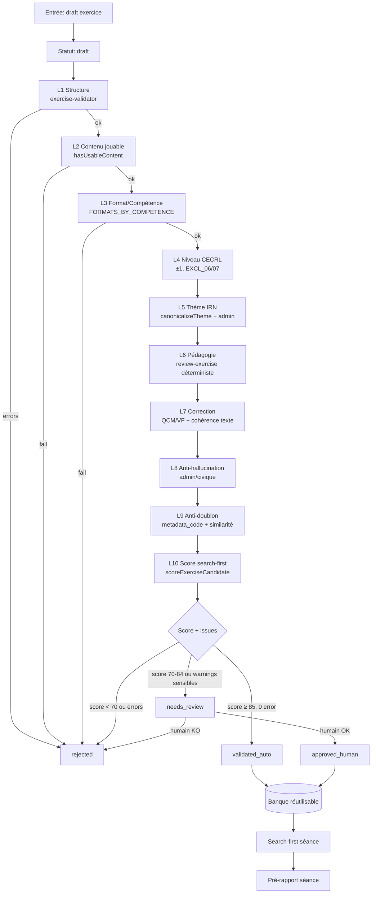
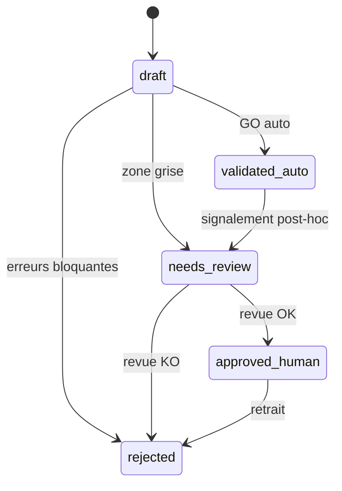

# Plan de validation automatique des exercices CapTCF

**Projet :** `primo-fluency-hub`  
**Date :** 7 juillet 2026

## Décision et statut

| Élément | Valeur |
|---------|--------|
| **Statut** | Cadrage architecture — aucune migration, aucun code dans ce commit |
| **Objectif** | Validation automatique avant banque/séance ; revue humaine = exception |

---

## 1. Contexte et objectif

Aujourd'hui, la validation est **inline** dans les Edge Functions (`validateAndFix` + `reviewExercise`) au moment de la génération. Elle n'est ni persistée ni réutilisée pour filtrer la banque existante. Le search-first (`exercise-search.ts`) applique seulement `hasUsableContent` + scoring contextuel, sans garantie que l'exercice a passé une QA complète.

**Cible :** un pipeline unique **ValidationChain** exécuté :
1. **À la création** (génération IA, import, pont curriculum, Lot 8 P0)
2. **À la réutilisation** (search-first, rattachement séance)
3. **En backfill** (exercices legacy sans trace de validation)

Réduction de la revue humaine aux cas ambigus ou sensibles (admin/civique, correction douteuse, premier exemplaire d'un type).

---

## 2. État des lieux — validateurs existants

### 2.1 `exercise-validator.ts` (structurel / TCF)

| Code | Sévérité | Règle |
|------|----------|-------|
| `missing_title`, `missing_consigne` | error | Champs obligatoires |
| `invalid_competence`, `invalid_format` | error | Enums |
| `consigne_too_long` | warning | > 15 mots (cible A0/A1 : 12) |
| `missing_audio_script` | error | CO sans `script_audio` |
| `missing_ce_text` | error | CE sans `texte` ≥ 20 car. |
| `no_items`, `item_no_question`, `item_no_answer` | error | Formats interactifs |
| `qcm_*`, `vf_invalid_answer` | error | Cohérence QCM/VF |
| `tcf_duration_off` | warning | `time_limit_seconds` hors plage code TCF |
| `duration_volume_mismatch` | error | Ratio durée stockée / recalculée ∉ [0,5 ; 2] |
| `invalid_difficulty` | error | `difficulte` ∉ [1, 10] |

`validateAndFix` : jusqu'à 3 régénérations IA, exclusion si échec.

### 2.2 `review-exercise.ts` (pédagogique)

- Déterministe : consigne vs directives, formats interdits, supports obligatoires, descente de compétence EE, feedback long, variante basse.
- IA (Gemini) : niveau A0/A1, cohérence consigne/questions, distracteurs, TCF IRN.
- `hasBlockingReviewIssue` : tout `severity === "error"` ou `!pedagogie_ok` ou `!directives_ok`.

### 2.3 `exercise-search.ts` (réutilisation)

- `hasUsableContent` : consigne + items (sauf production écrite/orale).
- `FORMATS_BY_COMPETENCE` : filtre EXCL_02 / SCORE_14.
- `scoreExerciseCandidate` : 0–100, hard filters EXCL_01–EXCL_10.
- Seuils : `REUSE_SCORE_MIN = 80`, `GENERATE_SCORE_MIN = 60`, fraîcheur 30 j.

### 2.4 `generate-exercises` (orchestration actuelle)

```
search-first → génération IA → validateAndFix → reviewExercise → scoreGeneratedExercise → réponse
```

Métadonnées éphémères : `pedagogical_review`, `search_score`, `generation_report`.

### 2.5 Scripts batch

| Script | Validation |
|--------|------------|
| `backfill-exercices-metadata.mjs` | Classification thème/contexte uniquement |
| `publish-bridge.mjs` | Upsert curriculum, pas de QA exercice |
| Lot 8 P0 (plan) | Pipeline proposé : Zod + ports validateur (§4 du lot8-p0-plan) |

### 2.6 Schéma `exercices` (existant)

Champs pertinents : `statut` (`draft`|`to_review`|`validated`|`published`|`rejected`|`archived`), `theme` (CHECK 8 valeurs), `contexte_irn`, `metadata_code`, `is_ai_generated`, `source`, `niveau_vise`, `competence`, `format`, `contenu`, `duree_limite_secondes`.

**Manquant :** score de validation, issues structurées, horodatage, source du contrôle, revue humaine tracée.

**Note :** `statut` couvre le cycle éditorial/publication ; ce plan propose un champ dédié `validation_status` pour ne pas casser les policies RLS (`auth_read_validated_exercises` lit `validated`/`published`).

---

## 3. Pipeline proposé



### Ordre d'exécution (fail-fast)

1. **Structure** — `validateExercise` (bloquant)
2. **Jouabilité** — `hasUsableContent`
3. **Format/compétence** — `format ∈ FORMATS_BY_COMPETENCE[competence]`
4. **Niveau CECRL** — `niveau_vise` dans fenêtre cible ±1 ; alerte si écart > 1
5. **Thème IRN** — `theme` canonique si ciblé ; cohérence `theme` ↔ `contexte_irn`
6. **Pédagogie** — `deterministicReview` (+ IA optionnelle si score incertain)
7. **Correction** — `bonne_reponse` vérifiable sans ambiguïté
8. **Anti-hallucination admin/civique** — entités sensibles (préfecture, droits, montants)
9. **Anti-doublon** — `metadata_code` unique ; similarité titre+consigne (seuil Jaccard)
10. **Score search-first** — `scoreGeneratedExercise` avec contexte séance type

---

## 4. Règles de validation détaillées

### 4.1 Structure (L1) — hérité `exercise-validator.ts`

Reprendre intégralement les codes existants. **Bloquant** : toute `severity === "error"`.

### 4.2 Contenu jouable (L2)

Identique à `hasUsableContent` :
- `consigne` non vide
- Si `format ∉ {production_ecrite, production_orale}` → `contenu.items.length ≥ 1`
- CE : `contenu.texte` présent (renforce L1)
- CO : `contenu.script_audio` présent

### 4.3 Format / compétence (L3)

```text
EXCL_02 : format NOT IN FORMATS_BY_COMPETENCE[competence] → error bloquant
```

Matrices (lecture seule, `exercise-search.ts`).

### 4.4 Niveau CECRL (L4)

| Règle | Sévérité | Détail |
|-------|----------|--------|
| `niveau_vise` ∈ {A0…B2} | error | Enum |
| Écart > 1 vs cible insertion | warning | `level_doubtful` |
| A0 + `production_ecrite` | error | EXCL_04 |
| B2 + `type_demarche=titre_sejour` | warning | EXCL_09 (contexte séance) |
| Consigne / questions vs niveau | warning/error | Longueur mots, subordonnées (review) |

### 4.5 Thème IRN (L5)

| Règle | Sévérité |
|-------|----------|
| `theme` non reconnu (hors 8 canoniques) | error si renseigné |
| Cible thématique séance + `theme` absent | warning `missing_theme` |
| `theme` ≠ inférence `contexte_irn` | warning `theme_context_mismatch` |
| Thèmes sensibles : `prefecture`, `vie_citoyenne` | flag `sensitive_admin` |

### 4.6 Pédagogie (L6)

Reprendre `review-exercise.ts` :
- Consigne ≤ 12 mots (A0/A1) ou selon directives
- Formats interdits, descente EE, supports obligatoires
- Variante basse si étayage fort

**IA** : déclenchée si score déterministe ∈ [70, 84] ou `sensitive_admin`.

### 4.7 Correction / contenu (L7)

| Règle | Sévérité |
|-------|----------|
| QCM : réponse ∈ options | error |
| VF : vrai/faux normalisé | error |
| CE : réponse vérifiable dans `texte` | error si non vérifiable |
| Plusieurs bonnes réponses plausibles | warning `ambiguous_correction` |
| `explication` > 22 mots (A0/A1) | warning |

### 4.8 Anti-hallucination admin / civique (L8)

Pour `theme ∈ {prefecture, vie_citoyenne, banque}` ou mots-clés admin :

| Contrôle | Sévérité |
|----------|----------|
| Montants, délais légaux inventés | error `hallucinated_admin_fact` |
| Organismes fictifs (ex. « Ministère de l'Intégration ») | error |
| Procédures impossibles (délais < réalité sans marqueur pédagogique) | warning |
| Liste blanche : CAF, OFII, préfecture, CPAM, France Travail | — |

**Méthode phase 1 :** règles lexicales + patterns (montants `€`, délais « X jours »).  
**Phase 2 :** appel IA structuré « fact-check IRN » avec référentiel interne.

### 4.9 Anti-doublon (L9)

| Contrôle | Action |
|----------|--------|
| `metadata_code` existant (même source) | error `duplicate_metadata_code` |
| Similarité titre normalisé > 0,85 | warning `near_duplicate_title` |
| Même `competence`+`format`+hash items | warning `near_duplicate_content` |
| Anti-redondance séance (contextes IRN, codes TCF) | warning (non bloquant banque) |

### 4.10 Score search-first (L10)

Utiliser `scoreGeneratedExercise(draft, target)` avec contexte type :
- `competence`, `niveauVise`, `themeId`, `typeDemarche`
- Stocker `validation_score` = score retourné
- Stocker `matched_rules` dans `validation_issues` (info)

---

## 5. Statuts et transitions

### 5.1 Énumération `validation_status` (nouveau champ)

| Statut | Signification |
|--------|---------------|
| `draft` | Jamais validé ou en cours de pipeline |
| `validated_auto` | GO automatique, utilisable banque/séance |
| `needs_review` | Ambiguïté ou warning sensible → file humaine |
| `rejected` | Échec bloquant ou rejet humain |
| `approved_human` | Validé manuellement après `needs_review` |

### 5.2 Relation avec `exercices.statut` (existant)

| `validation_status` | `statut` recommandé | RLS / search-first |
|---------------------|---------------------|-------------------|
| `draft` | `draft` | Non réutilisable |
| `validated_auto` | `validated` | Réutilisable si score ≥ 80 |
| `needs_review` | `to_review` | Non réutilisable |
| `approved_human` | `validated` ou `published` | Réutilisable |
| `rejected` | `rejected` | Exclu |

### 5.3 Diagramme de transitions



---

## 6. Schéma DB proposé (SQL draft — commenté, pas migration)

```sql
-- ═══════════════════════════════════════════════════════════════
-- DRAFT — Ne pas exécuter tel quel ; migration dédiée ultérieure
-- ═══════════════════════════════════════════════════════════════

-- Nouveau type (ou TEXT + CHECK)
-- CREATE TYPE public.exercice_validation_status AS ENUM (
--   'draft', 'validated_auto', 'needs_review', 'rejected', 'approved_human'
-- );

ALTER TABLE public.exercices
  -- ADD COLUMN validation_status text NOT NULL DEFAULT 'draft'
  --   CHECK (validation_status IN (
  --     'draft', 'validated_auto', 'needs_review', 'rejected', 'approved_human'
  --   )),
  -- Score agrégé 0-100 (juge search-first + pénalités validation)
  -- ADD COLUMN validation_score smallint CHECK (validation_score BETWEEN 0 AND 100),
  -- Issues structurées : [{code, severity, message, field?, layer?}]
  -- ADD COLUMN validation_issues jsonb NOT NULL DEFAULT '[]'::jsonb,
  -- ADD COLUMN validation_checked_at timestamptz,
  -- Source du dernier contrôle : pipeline_auto | import | backfill | human
  -- ADD COLUMN validation_source text
  --   CHECK (validation_source IS NULL OR validation_source IN (
  --     'pipeline_auto', 'import', 'backfill', 'human', 'regeneration'
  --   )),
  -- Revue humaine
  -- ADD COLUMN reviewed_by uuid REFERENCES public.profiles(id),
  -- ADD COLUMN reviewed_at timestamptz;

-- Index pour search-first : ne sélectionner que les exercices validés
-- CREATE INDEX idx_exercices_validation_reuse
--   ON public.exercices (competence, niveau_vise, validation_status)
--   WHERE is_template = false AND eleve_id IS NULL
--     AND validation_status IN ('validated_auto', 'approved_human');

-- Option : table d'audit append-only (historique des passes)
-- CREATE TABLE public.exercice_validation_runs (
--   id uuid PRIMARY KEY DEFAULT gen_random_uuid(),
--   exercice_id uuid NOT NULL REFERENCES public.exercices(id) ON DELETE CASCADE,
--   run_at timestamptz NOT NULL DEFAULT now(),
--   validation_status text NOT NULL,
--   validation_score smallint,
--   validation_issues jsonb NOT NULL DEFAULT '[]',
--   validation_source text,
--   context jsonb  -- cible séance, version pipeline
-- );
```

---

## 7. Critères GO / NO-GO

### 7.1 GO automatique → `validated_auto`

Toutes les conditions **simultanées** :

| # | Critère |
|---|---------|
| G1 | Aucune issue `severity === "error"` (toutes couches) |
| G2 | `validation_score ≥ 85` (search-first simulé) |
| G3 | `hasUsableContent === true` |
| G4 | `format ∈ FORMATS_BY_COMPETENCE[competence]` |
| G5 | Pas de flag `sensitive_admin` **ou** couche L8 passée sans error |
| G6 | Pas de `ambiguous_correction` |
| G7 | Warnings acceptables : `consigne_too_long`, `tcf_duration_off`, `feedback_too_long`, `near_duplicate_title` (si score ≥ 90) |

### 7.2 NO-GO → `rejected`

- Toute error structurelle, format, correction, hallucination admin
- `validation_score < 70`
- Échec `validateAndFix` après 3 tentatives
- Doublon `metadata_code` strict

### 7.3 Zone grise → `needs_review`

| Trigger | Exemple |
|---------|---------|
| Score 70–84 | Exercice acceptable mais sous-optimal pour réutilisation |
| `ambiguous_correction` | Deux options défendables |
| `level_doubtful` | B2 annoté avec vocabulaire A1 |
| `sensitive_admin` + warnings L8 | Préfecture, naturalisation |
| `is_ai_generated` + créé < 24 h | `recently_generated` |
| Premier `format`+`competence`+`niveau_vise` en banque | `first_of_type` |
| `review-exercise` source `deterministic_ai_failed` | IA review indisponible |

**Warnings seuls** (sans trigger ci-dessus) + score ≥ 85 → **GO** (`validated_auto`).

---

## 8. Déclencheurs revue humaine

| ID | Condition | Priorité |
|----|-----------|----------|
| H1 | `validation_status = needs_review` | P0 |
| H2 | `theme IN (prefecture, vie_citoyenne)` ET score < 90 | P0 |
| H3 | `ambiguous_correction` | P0 |
| H4 | `hallucinated_admin_fact` (même si corrigé auto) | P0 |
| H5 | Score ∈ [70, 84] | P1 |
| H6 | `is_ai_generated` ET `created_at` < 24 h | P1 |
| H7 | Premier exemplaire `(competence, format, niveau_vise)` | P1 |
| H8 | ≥ 3 warnings distinctes | P2 |

**SLA suggéré :** P0 avant publication séance ; P1 sous 48 h ; P2 file hebdomadaire.

---

## 9. Rapport pré-séance

Structure JSON renvoyée par `findReusableExercises` + couche validation :

```json
{
  "session_id": "uuid",
  "generated_at": "ISO8601",
  "target": {
    "competence": "CE",
    "niveau_vise": "B2",
    "theme_id": "vie_citoyenne",
    "type_demarche": "naturalisation"
  },
  "summary": {
    "requested": 5,
    "reused_from_bank": 3,
    "generated": 2,
    "needs_review": 0,
    "rejected": 0,
    "fallback_used": 0
  },
  "validation_gate": {
    "min_validation_status": ["validated_auto", "approved_human"],
    "min_validation_score": 80,
    "blocked_unvalidated": 12
  },
  "exercises": [
    {
      "id": "uuid",
      "source": "banque",
      "titre": "...",
      "validation_status": "validated_auto",
      "validation_score": 92,
      "search_score": 88,
      "validation_issues": [],
      "fresh": true,
      "decision": "reuse"
    },
    {
      "id": "uuid",
      "source": "genere",
      "validation_status": "validated_auto",
      "validation_score": 87,
      "search_score": 87,
      "validation_issues": [
        {"code": "consigne_too_long", "severity": "warning"}
      ],
      "decision": "generate"
    }
  ],
  "human_review_queue": [],
  "warnings": ["1 exercice banque exclu : validation_status=draft"]
}
```

**UI formateur (Piloter la séance) :** badge vert/orange/rouge par exercice ; lien vers file `needs_review`.

---

## 10. Intégration search-first + Lot 8 P0

### 10.1 Search-first (`exercise-search.ts` — modification future)

Filtre SQL additionnel (après migration) :

```text
validation_status IN ('validated_auto', 'approved_human')
```

Conserver `hasUsableContent` comme filet L2. Le score `REUSE_SCORE_MIN = 80` s'applique sur candidats **déjà validés**.

**Génération :** après pipeline, persister `validation_*` avant insert ; n'insérer en banque que si `validated_auto` ou `approved_human`.

### 10.2 Lot 8 P0 (`docs/lot8-p0-plan.md`)

| Étape Lot 8 | Intégration ValidationChain |
|-------------|----------------------------|
| Dry-run pilote B2 CE | Exécuter pipeline en mémoire, manifest avec `validation_status` simulé |
| `--apply` B2 CE | Insert uniquement si `validated_auto` ; sinon `needs_review` dans manifest sans insert |
| `sf-p0-validate.mjs` | Wrapper Node : ports `validateExercise` + `hasUsableContent` + scoring |
| `theme` obligatoire | Règle L5 |
| Idempotence `metadata_code` | Règle L9 |

**Alignement seuils :** Lot 8 exige validation avant écriture → ce plan formalise ce que le lot 8 décrit en §4.4.

### 10.3 Backfill legacy

Script `backfill-exercise-validation.mjs` (futur) :
1. Sélectionner `validation_status IS NULL OR validation_status = 'draft'`
2. Exécuter ValidationChain sans IA (L1–L7, L9–L10)
3. `validated_auto` si GO ; sinon `needs_review` avec issues
4. Ne pas modifier `statut=published` existants sans revue

---

## 11. Ordre d'implémentation progressif

| Phase | Périmètre | Livrable |
|-------|-----------|----------|
| **0 — Cadrage** | Ce document | `docs/validation-auto-exercices-plan.md` |
| **1 — Module partagé** | `validation-chain.ts` : L1–L3, agrégation issues/score | Tests unitaires |
| **2 — Migration DB** | Colonnes `validation_*`, index, enum | Migration Supabase |
| **3 — Persistance génération** | Brancher après `generate-exercises` | Exercices générés tagués |
| **4 — Search-first** | Filtre `validation_status` dans requête banque | Moins de candidats non fiables |
| **5 — L6–L8** | Pédagogie + anti-hallucination admin | Réduction `needs_review` |
| **6 — Lot 8 pilote** | `sf-p0-validate.mjs` + dry-run B2 CE | 14 exercices validés auto |
| **7 — UI revue** | File `needs_review`, actions approve/reject | `approved_human` |
| **8 — Backfill** | 621 exercices legacy | Couverture banque |
| **9 — Pré-rapport séance** | Extension `generation_report` | Visibilité formateur |

---

## 12. Métriques de succès

| Métrique | Cible |
|----------|-------|
| % banque `validated_auto` + `approved_human` | > 95 % (post-backfill) |
| % générations sans revue humaine | > 85 % |
| % réutilisation search-first (vs génération) | +15 pts vs baseline |
| Faux positifs `needs_review` | < 10 % |
| Exercices `rejected` en séance | 0 |

---

## 13. Risques et mitigations

| Risque | Mitigation |
|--------|------------|
| Double sémantique `statut` / `validation_status` | Mapping documenté §5.2 ; migration progressive |
| Coût IA L6/L8 | IA seulement zone grise |
| Régression search-first | Feature flag `require_validation_status` |
| Banque legacy non validée | Backfill phase 8 avant enforcement strict |

---

*Document de cadrage — aucune migration ni modification de code dans ce commit.*
